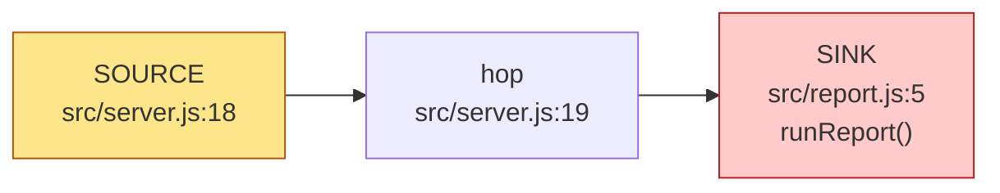
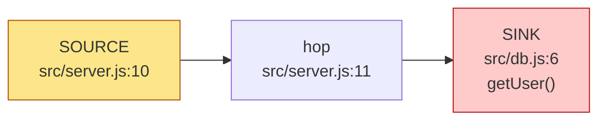

# Security audit — full

repo `examples/vuln-express` · ultrasec 0.0.0-development  
findings: **3** — 🟥 CRITICAL 1 · 🟧 HIGH 1 · 🟨 MEDIUM 1 · 🟩 LOW 0 · ⬜ INFO 0  
tools: none (graph + taint only)

## Confirmed (2)

### 🟥 CRITICAL OS command injection: untrusted input reaches execSync()

`3ffa0917b004` · [CWE-78](https://cwe.mitre.org/data/definitions/78.html) · taint · status **confirmed** · verdict supported · confidence high

**Path:** `src/server.js:18` → `src/server.js:19` → `src/report.js:5`

Cross-file candidate: http input at src/server.js:18 may reach the command sink execSync() at src/report.js:5 through 2 hop(s). Tainted data in a shell command. Prefer argv-array exec (execFile/execve) over a shell string; verify no shell metacharacters reach a shell. Heuristic — verify the data actually reaches the sink unsanitized before trusting it.

Verdict (supported): req.query.name flows into execSync shell string in report.runReport

**Exploit path:** GET /report?name=x;id

References: <https://cwe.mitre.org/data/definitions/78.html>

### 🟧 HIGH SQL injection: untrusted input reaches query()

`54b733703450` · [CWE-89](https://cwe.mitre.org/data/definitions/89.html) · taint · status **confirmed** · verdict supported · confidence high

**Path:** `src/server.js:10` → `src/server.js:11` → `src/db.js:6`

Cross-file candidate: http input at src/server.js:10 may reach the sql sink query() at src/db.js:6 through 2 hop(s). Tainted data concatenated into a SQL statement. Verify it isn't a parameterized/prepared query. Heuristic — verify the data actually reaches the sink unsanitized before trusting it.

Verdict (supported): req.query.id concatenated into SQL across files; getUser builds a raw query

**Exploit path:** GET /user?id=1 OR 1=1 -- 

References: <https://cwe.mitre.org/data/definitions/89.html>

## Dismissed (1)

### 🟨 MEDIUM Cross-site scripting (reflected): untrusted input reaches send()

`9b0bcc91ea6a` · [CWE-79](https://cwe.mitre.org/data/definitions/79.html) · taint · status **dismissed** · verdict refuted · confidence low

**Path:** `src/server.js:18` → `src/server.js:20`

Intra-file candidate: http input at src/server.js:18 may reach the xss sink send() at src/server.js:20 through 1 hop(s). Tainted data written to an HTML response. Verify it is contextually escaped before reaching the browser. Heuristic — verify the data actually reaches the sink unsanitized before trusting it.

Verdict (refuted): res.send echoes server-generated report text, not attacker HTML in a browser-executable context

References: <https://cwe.mitre.org/data/definitions/79.html>

---
Engine: ultrasec 0.0.0-development. Taint candidates are deterministic; external-tool results depend on installed scanners.
