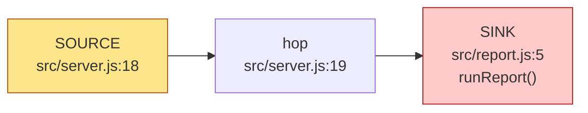
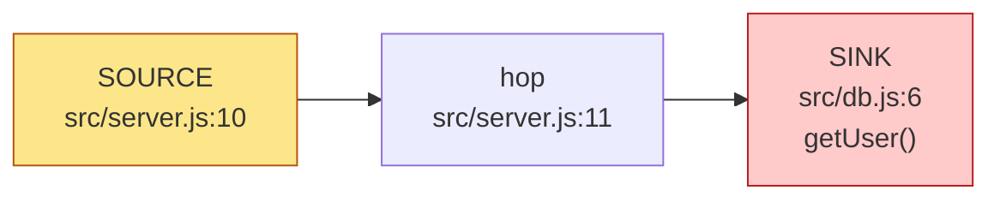
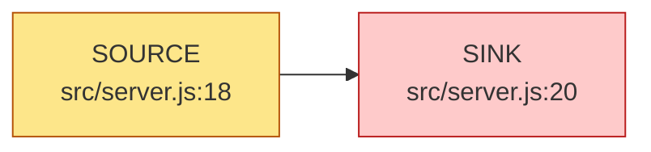

# Security audit — full

repo `examples/vuln-express` · ultrasec 0.0.0-development  
findings: **3** — 🟥 CRITICAL 1 · 🟧 HIGH 1 · 🟨 MEDIUM 1 · 🟩 LOW 0 · ⬜ INFO 0  
tools: none (graph + taint only)  
_ranked by composite risk (severity ⊕ EPSS ⊕ KEV)_

## Executive summary (AI-authored)
_AI-authored — verify against the cited findings before acting._

Two confirmed injection vulnerabilities in a public Express API: untrusted req.query values reach a raw SQL query and a shell command across files, with no validation. Both are directly exploitable by any client.

## Confirmed (3)

### 🟥 CRITICAL OS command injection: untrusted input reaches execSync()

`3ffa0917b004` · [CWE-78](https://cwe.mitre.org/data/definitions/78.html) · taint · status **confirmed** · verdict supported · confidence high

**Risk:** risk 60

**Path:** `src/server.js:18` → `src/server.js:19` → `src/report.js:5`

Cross-file candidate: http input at src/server.js:18 may reach the command sink execSync() at src/report.js:5 through 2 hop(s). Tainted data in a shell command. Prefer argv-array exec (execFile/execve) over a shell string; verify no shell metacharacters reach a shell. Heuristic — verify the data actually reaches the sink unsanitized before trusting it.

Revalidation (still-valid): still present at HEAD

**Exploit path:** GET /report?name=$(id)

**Suggested fix (AI):** Use execFile with an argv array; never build a shell string from input. · owner @backend

References: <https://cwe.mitre.org/data/definitions/78.html>

### 🟧 HIGH SQL injection: untrusted input reaches query()

`54b733703450` · [CWE-89](https://cwe.mitre.org/data/definitions/89.html) · taint · status **confirmed** · verdict supported · confidence high

**Risk:** risk 48

**Path:** `src/server.js:10` → `src/server.js:11` → `src/db.js:6`

Cross-file candidate: http input at src/server.js:10 may reach the sql sink query() at src/db.js:6 through 2 hop(s). Tainted data concatenated into a SQL statement. Verify it isn't a parameterized/prepared query. Heuristic — verify the data actually reaches the sink unsanitized before trusting it.

Revalidation (still-valid): still present at HEAD

**Exploit path:** GET /user?id=1 OR 1=1

**Suggested fix (AI):** Use a parameterized query (placeholders), never string concatenation. · owner @backend

References: <https://cwe.mitre.org/data/definitions/89.html>

### 🟨 MEDIUM Cross-site scripting (reflected): untrusted input reaches send()

`9b0bcc91ea6a` · [CWE-79](https://cwe.mitre.org/data/definitions/79.html) · taint · status **confirmed** · verdict supported · confidence high

**Risk:** risk 30

**Path:** `src/server.js:18` → `src/server.js:20`

Intra-file candidate: http input at src/server.js:18 may reach the xss sink send() at src/server.js:20 through 1 hop(s). Tainted data written to an HTML response. Verify it is contextually escaped before reaching the browser. Heuristic — verify the data actually reaches the sink unsanitized before trusting it.

Revalidation (still-valid): still present at HEAD

**Exploit path:** GET /report?name=$(id)

**Suggested fix (AI):** Use execFile with an argv array; never build a shell string from input. · owner @backend

References: <https://cwe.mitre.org/data/definitions/79.html>

## Attack chains (AI-authored)
_AI-authored — verify against the cited findings before acting._

### Unauthenticated SQL injection via /user
- findings: `54b733703450`

GET /user?id=... flows req.query.id across server.js into a string-concatenated SQL query in db.getUser.

## Root-cause groups (AI-authored)
_AI-authored — verify against the cited findings before acting._

### Untrusted request input concatenated into interpreters
- findings: `3ffa0917b004`, `54b733703450`, `9b0bcc91ea6a`

Centralize input handling: parameterized queries + argv-array exec, plus an input-validation layer.

---
Engine: ultrasec 0.0.0-development. Taint candidates are deterministic; external-tool results depend on installed scanners.
