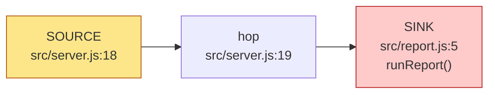
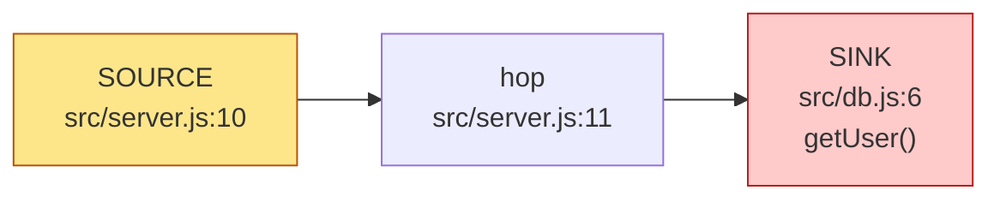

# Security audit — report

repo `examples/vuln-express` · ultrasec 0.0.0-development  
findings: **3** — 🟥 CRITICAL 1 · 🟧 HIGH 1 · 🟨 MEDIUM 1 · 🟩 LOW 0 · ⬜ INFO 0  
tools: none (graph + taint only)  
_ranked by composite risk (severity ⊕ EPSS ⊕ KEV)_

## Executive summary (AI-authored)
_AI-authored — verify against the cited findings before acting._

Two confirmed injection flaws in a public Express API. Untrusted req.query values cross file boundaries into a raw SQL statement and a shell command, with no validation on any hop and no authentication on either route, so both are exploitable by any unauthenticated client — command injection first, which yields code execution as the app user. Both come from the same habit: request values handed straight to a helper that builds an interpreter string.

## What the codebase does well (AI-authored)
_AI-authored — verify against the cited findings before acting._

The data layer already knows how to do this correctly — db.getUserSafe (src/db.js:11) uses a `?` placeholder with a parameter array, so the parameterized path exists and is the one to standardize on. The two findings below are deviations from it, not a missing capability.

## Confirmed (2)

### 🟥 CRITICAL OS command injection: untrusted input reaches execSync()

`3ffa0917b004` · [CWE-78](https://cwe.mitre.org/data/definitions/78.html) · taint · status **confirmed** · verdict supported · confidence high

**Risk:** risk 60

**Path:** `src/server.js:18` → `src/server.js:19` → `src/report.js:5`

Cross-file candidate: http input at src/server.js:18 may reach the command sink execSync() at src/report.js:5 through 2 hop(s). Tainted data in a shell command. Prefer argv-array exec (execFile/execve) over a shell string; verify no shell metacharacters reach a shell. Heuristic — verify the data actually reaches the sink unsanitized before trusting it.

Verdict (supported): req.query.name is concatenated into a shell string at report.js:5 and executed with execSync; no validation on any hop, and the route has no auth.

Revalidation (still-valid): report.js:5 is unchanged at HEAD — still execSync on a concatenated string.

**Exploit path:** GET /report?name=x;sleep%205 · unauthenticated → the response takes 5s (baseline ~40ms), proving shell execution as the app user

**Suggested fix (AI):** Replace execSync with execFile and an argv array: execFile("generate-report", ["--for", name]). An argv array removes the shell, but it does not stop argument injection — validate `name` against an allow-list (or pass it after a `--` terminator) so it can't be read as an option. · owner @backend

```diff
- return execSync("generate-report --for " + name).toString();
+ return execFileSync("generate-report", ["--for", "--", name]).toString();
```



References: <https://cwe.mitre.org/data/definitions/78.html>

### 🟧 HIGH SQL injection: untrusted input reaches query()

`54b733703450` · [CWE-89](https://cwe.mitre.org/data/definitions/89.html) · taint · status **confirmed** · verdict supported · confidence high

**Risk:** risk 48

**Path:** `src/server.js:10` → `src/server.js:11` → `src/db.js:6`

Cross-file candidate: http input at src/server.js:10 may reach the sql sink query() at src/db.js:6 through 2 hop(s). Tainted data concatenated into a SQL statement. Verify it isn't a parameterized/prepared query. Heuristic — verify the data actually reaches the sink unsanitized before trusting it.

Verdict (supported): req.query.id is concatenated into SQL at db.js:5 and reaches sqlite.query() with no parameter array. The parameterized sibling getUserSafe (db.js:11) is NOT on this path.

Revalidation (still-valid): db.js:6 is unchanged at HEAD, and the concatenation it consumes is still at db.js:5.

**Exploit path:** GET /user?id=1%20OR%201=1 · unauthenticated → returns every row of `users`, proving the value is parsed as SQL, not data

**Suggested fix (AI):** Bind the value instead of concatenating it, exactly as getUserSafe already does: sqlite.query("SELECT * FROM users WHERE id = ?", [id]). · owner @backend

```diff
- const sql = "SELECT * FROM users WHERE id = " + id;
- return sqlite.query(sql);
+ return sqlite.query("SELECT * FROM users WHERE id = ?", [id]);
```



References: <https://cwe.mitre.org/data/definitions/89.html>

## Dismissed (1)

### 🟨 MEDIUM Cross-site scripting (reflected): untrusted input reaches send()

`9b0bcc91ea6a` · [CWE-79](https://cwe.mitre.org/data/definitions/79.html) · taint · status **dismissed** · verdict unsupported · confidence low

**Risk:** risk 30

**Path:** `src/server.js:18` → `src/server.js:20`

Intra-file candidate: http input at src/server.js:18 may reach the xss sink send() at src/server.js:20 through 1 hop(s). Tainted data written to an HTML response. Verify it is contextually escaped before reaching the browser. Heuristic — verify the data actually reaches the sink unsanitized before trusting it.

Verdict (unsupported): The argument to res.send() at server.js:20 is `out` — the return value of runReport() — not req.query.name, so the query parameter is never reflected. The attacker does control that output, but only by way of the command injection at report.js:5, whose impact (RCE) subsumes it; reporting a separate MEDIUM XSS would double-count one bug. Tracked by 3ffa0917b004.

References: <https://cwe.mitre.org/data/definitions/79.html>

## Attack chains (AI-authored)
_AI-authored — verify against the cited findings before acting._

### Unauthenticated code execution, then data access
- findings: `3ffa0917b004` → `54b733703450`

Neither route requires authentication. GET /report gives shell execution as the app user (report.js:5), which already reaches the database file directly; GET /user independently returns arbitrary rows (db.js:6). Fixing only the SQL injection leaves the stronger path intact.

## Root-cause groups (AI-authored)
_AI-authored — verify against the cited findings before acting._

### Request values handed to a helper that builds an interpreter string
- findings: `3ffa0917b004`, `54b733703450`

Both handlers read req.query.* and pass it, unvalidated, to a helper that concatenates it into SQL or a shell command. The fix is structural, not per-site: bind parameters at the data layer and use argv arrays for process execution, then add validation at the route boundary so a future helper inherits neither habit.

## Hardening notes (AI-authored)
_AI-authored — verify against the cited findings before acting._

_Defense-in-depth suggestions — **not** findings (the attack is already prevented elsewhere); excluded from the severity counts._

- Neither route validates the shape of its input before use (an integer id, a report name from a known set). Type/shape validation at the boundary is defense in depth once the two fixes above land — it is not what makes them exploitable today.
- res.send() at server.js:20 returns command output with the default text/html content type. Once the command injection is fixed the attacker no longer controls that body, but setting an explicit content type (or res.json) removes the reflected-content question entirely.

---
Engine: ultrasec 0.0.0-development. Taint candidates are deterministic; external-tool results depend on installed scanners.
